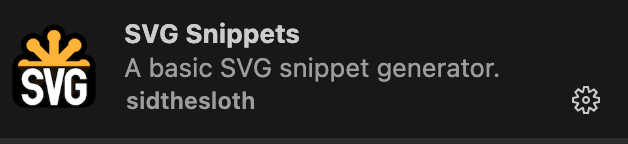
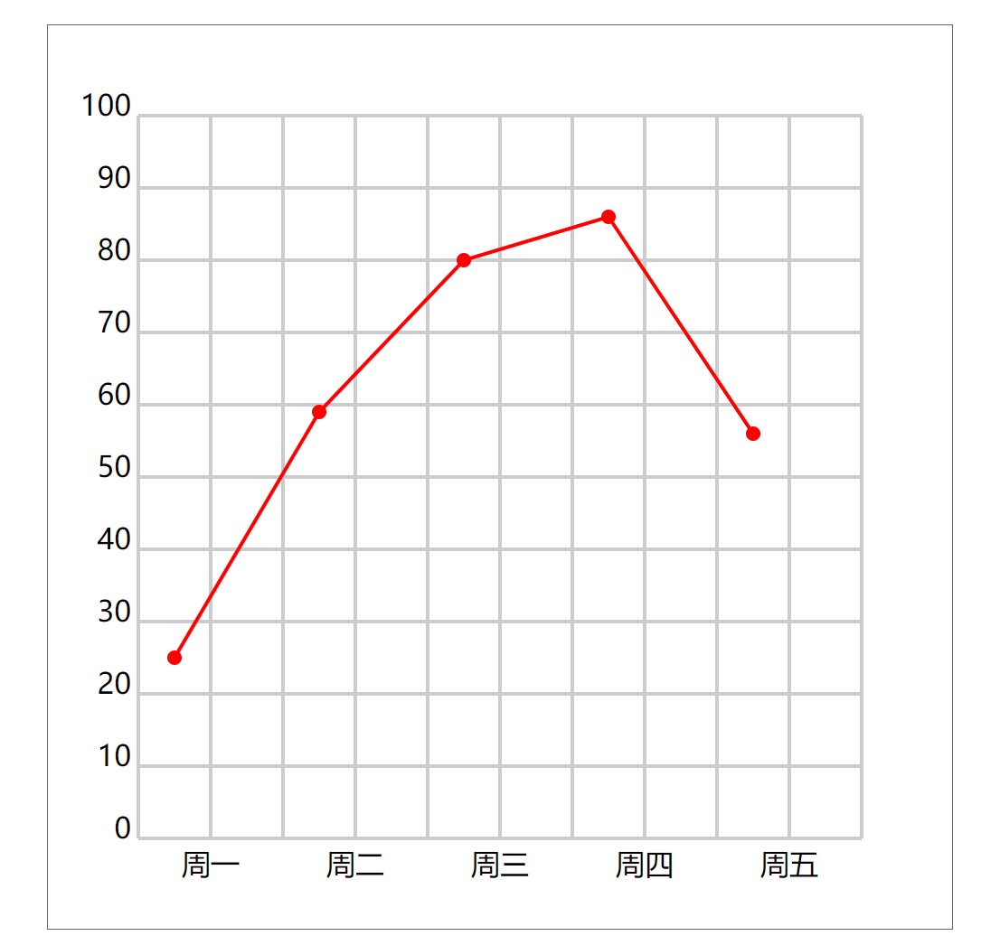
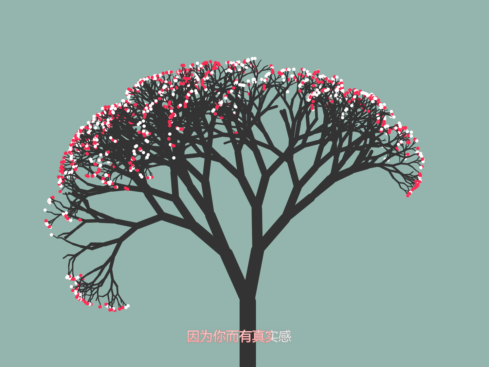
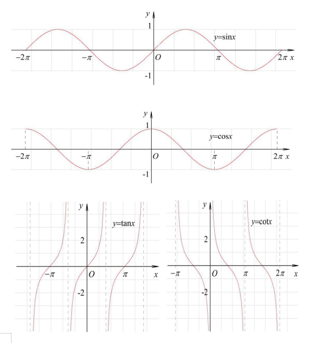
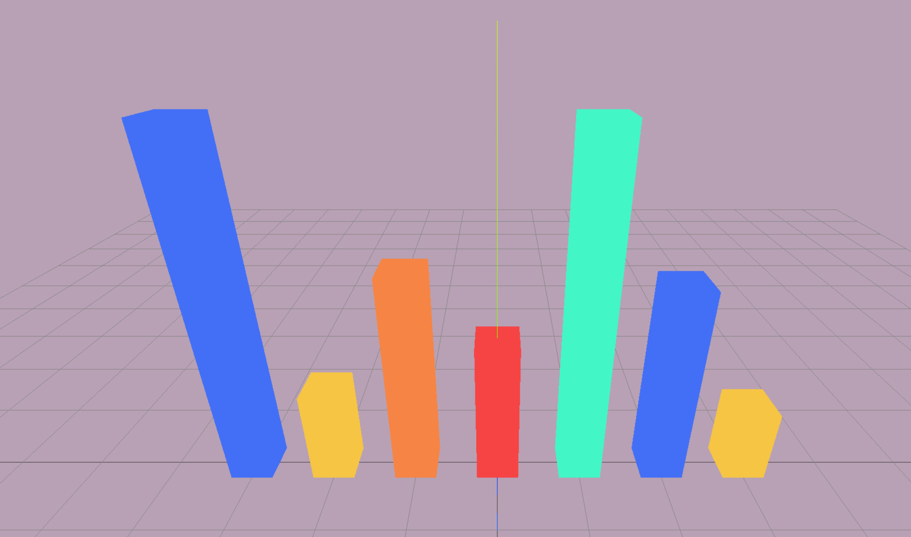

# 谈谈你不知道的前端图形技术

## SVG

先整理几个插件用于快速开发 svg

### 圆

圆是基于一个圆心和一个半径。

> `<circle cx="250" cy="250" r="50" style="fill:blue" />`

- cx 为 圆心的 x轴
- cy 为 圆心的 y轴
- r 为 圆的半径

### 折线图 demo

1. 定义创建的函数
2. 获取 space ySpace  xSpace maxNumberUpLimit
3. x轴坐标 以及 y轴坐标
4. x轴文本内容 以及 y轴文本数字
5. polyline折线以及circle圆点

## Canvas

### 基础操作

### 画一个小树

1. 设置画布的宽高比例 保证画布不会变形
2. 将画布的坐标系进行转换  移至画布宽度的中心 以及 高度的底部
3. 将画布的坐标系进行转换  将画布的y轴进行翻转
4. 开始绘制小树
5. 设定一个绘制函数参数为 v0:线条的坐标 thick:线条的粗细 length:线条的长度 alpha:线条的生长角度
6. 在数学中，三角函数（如正弦和余弦）通常使用弧度作为输入。但是，我们通常在度数（以角度为单位）上思考和操作。因此，为了将角度转换为弧度，我们需要将角度乘以 π（PI）并除以 180 来得到相应的弧度值。  `Math.cos()` 求余弦值, `Math.sin()` 求正弦值。`Math.tan()` 求正切值
7. 因此,在我们案例中 用余弦求目标的x值,用正弦求目标的y值。
8. x = `Math.cos((alpha * Math.PI) / 180)`
9. y = `Math.sin((alpha * Math.PI) / 180)`
10. 当我们设定了一个绘制函数,那我们将不停的调用该绘制函数来一直不停的绘制下去，当然，如果没有判空条件则将陷入栈内存爆满的情况我们需要设定条件。
    - 当线条的粗细小于10的话将终止绘画
    - 当线条的粗细小于2或者3 的时候可以渲染一些小花
11. 然而最后一个条件我们每次执行的时候会有问题就是我们如果用递归的话将会造成浏览器主渲染进程压力太大，制定动画可以才有 `requestAnimationFrame`

## ThreeJs

## 总结

图形学